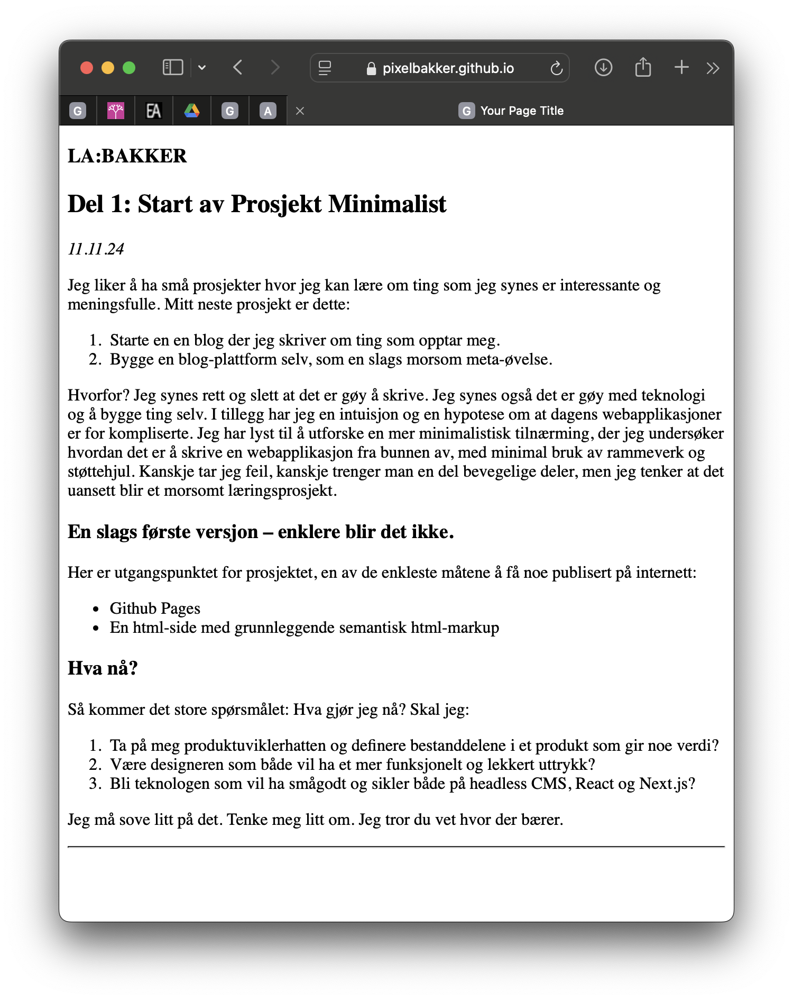

# Del 1: Start av Prosjekt Minimalist
Publisert: November 11, 2024

Jeg liker å ha små prosjekter hvor jeg kan lære om ting som jeg synes er interessante og meningsfulle.

Mitt neste prosjekt er dette:
- Starte en en blog der jeg skriver om ting som opptar meg.
- Bygge en blog-plattform selv, som en slags morsom meta-øvelse.

Hvorfor? Jeg synes rett og slett at det er gøy å skrive. Jeg synes også det er gøy med teknologi og å bygge ting selv. I tillegg har jeg en intuisjon og en hypotese om at dagens webapplikasjoner er for kompliserte. Jeg har lyst til å utforske en mer minimalistisk tilnærming, der jeg undersøker hvordan det er å skrive en webapplikasjon fra bunnen av, med minimal bruk av rammeverk og støttehjul. Kanskje tar jeg feil, kanskje trenger man en del bevegelige deler, men jeg tenker at det uansett blir et morsomt læringsprosjekt.

### En slags første versjon – enklere blir det ikke.
            
Her er utgangspunktet for prosjektet, en av de enkleste måtene å få noe publisert på internett:
         
- Github Pages
- En html-side med grunnleggende semantisk html-markup
            
### Hva nå?
Så kommer det store spørsmålet: Hva gjør jeg nå? Skal jeg:

- Ta på meg produktuviklerhatten og definere bestanddelene i et produkt som gir minste verdi?
- Være designeren som både vil ha et mer funksjonelt og lekkert uttrykk?
- Bli teknologen som vil ha smågodt og sikler både på headless CMS, React og Next.js?
            
Jeg må sove litt på det. Tenke meg litt om. Jeg tror du vet hvor det bærer. Alternativ 3 har jeg jo allerede utelukket, så da så.
            

### Dokumentasjon
For å dokumentere fremdrift tenker jeg å ta bilde av all ny funksjonalitet slik at du kan følge med på endringene. Her er siden i første versjon:

